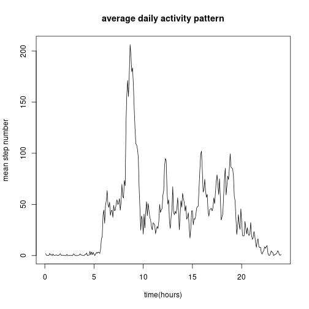
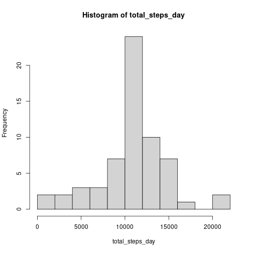
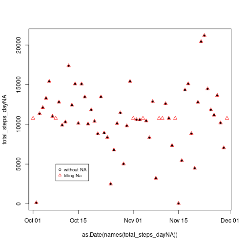
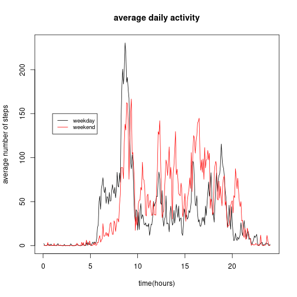

## Loading and preprocessing the data


```r
    data<- read.csv("./repdata_data_activity/activity.csv", sep = ",", na.strings = "NA")
    summary(data)
```

```
##      steps            date              interval     
##  Min.   :  0.00   Length:17568       Min.   :   0.0  
##  1st Qu.:  0.00   Class :character   1st Qu.: 588.8  
##  Median :  0.00   Mode  :character   Median :1177.5  
##  Mean   : 37.38                      Mean   :1177.5  
##  3rd Qu.: 12.00                      3rd Qu.:1766.2  
##  Max.   :806.00                      Max.   :2355.0  
##  NA's   :2304
```

```r
    table(is.na(data$steps))
```

```
## 
## FALSE  TRUE 
## 15264  2304
```

I will create a new data.frame, that contains only numeric values of data:


```r
data2<-data[(!is.na(data$steps)),]
summary(data2)
```

```
##      steps            date              interval     
##  Min.   :  0.00   Length:15264       Min.   :   0.0  
##  1st Qu.:  0.00   Class :character   1st Qu.: 588.8  
##  Median :  0.00   Mode  :character   Median :1177.5  
##  Mean   : 37.38                      Mean   :1177.5  
##  3rd Qu.: 12.00                      3rd Qu.:1766.2  
##  Max.   :806.00                      Max.   :2355.0
```

## What is mean total number of steps taken per day?


```r
    total_steps_day<-tapply(data2$steps, INDEX=as.factor(data2$date), FUN=sum)
    mean(total_steps_day)
```

```
## [1] 10766.19
```


## What is the average daily activity pattern?

Make a time series plot (i.e. type = "l") of the 5-minute interval (x-axis) and the average number of steps taken, averaged across all days (y-axis)


```r
mean_steps_hour<-tapply(data2$steps, INDEX=as.factor(data2$interval), FUN=mean)
str(mean_steps_hour)
```

```
##  num [1:288(1d)] 1.717 0.3396 0.1321 0.1509 0.0755 ...
##  - attr(*, "dimnames")=List of 1
##   ..$ : chr [1:288] "0" "5" "10" "15" ...
```


```r
plot(x=seq_along(mean_steps_hour)*(5/60) , y=mean_steps_hour, main="average daily activity pattern", xlab = "time(hours)" , ylab="mean step number" , type="l")
```



Which 5-minute interval, on average across all the days in the dataset, contains the maximum number of steps?


```r
which.max(mean_steps_hour)
```

```
## 835 
## 104
```

this means that the interval of maximum number of steps is the interval named 835, that corresponds to the index 104 of the array (8:40 am). 


```r
mean_steps_hour[names(mean_steps_hour)==835]
```

```
##      835 
## 206.1698
```

## Imputing missing values

Calculate and report the total number of missing values in the dataset (i.e. the total number of rows with NAs)


```r
    table(is.na(data$steps))
```

```
## 
## FALSE  TRUE 
## 15264  2304
```

there are 2304 NA in the data.

Devise a strategy for filling in all of the missing values in the dataset: filling the NA values with the mean for that 5-minute interval. 
Create a new dataset that is equal to the original dataset but with the missing data filled in.


```r
na_indexes<-which(is.na(data$steps))
data3<-data
data3$index<-seq_along(1:288)
data3[na_indexes,1]<-mean_steps_hour[data3$index[na_indexes]]
table(is.na(data3[,1]))
```

```
## 
## FALSE 
## 17568
```


Make a histogram of the total number of steps taken each day 


```r
total_steps_day<-tapply(data3$steps, INDEX=as.factor(data3$date), FUN=sum)
hist(total_steps_day, breaks = 12)
```



Calculate and report the mean and the median of the total number of steps taken per day. Do these values differ from the estimates from the first part of the assignment? What is the impact of imputing missing data on the estimates of the total daily number of steps?


```r
total_steps_dayNA<-tapply(data2$steps, INDEX=as.factor(data2$date), FUN=sum)
meanNA<-mean(total_steps_dayNA)
medianNA<-median(total_steps_dayNA)

total_steps_day<-tapply(data3$steps, INDEX=as.factor(data3$date), FUN=sum)
mean<-mean(total_steps_day)
median<-median(total_steps_day)
```

Total removing NA= 570608 total filling NA= 656737.509433962

Mean  removing NA=10766.1886792453 Mean  filling NA=10766.1886792453

Median removing NA=10765 Median filling NA=10766.1886792453

 What is the impact of imputing missing data on the estimates of the total daily number of steps?
 
 
 ```r
    plot(x=as.Date(names(total_steps_dayNA)) , y=total_steps_dayNA, pch=20)
    points(x=as.Date(names(total_steps_day)) , y=total_steps_day, lty=2, pch=2, col="red")
    legend(as.Date(as.Date(names(total_steps_day))[8]), 5000, legend=c("without NA", "filling Na"),
      col=c("black", "red"), pch=1:2, cex=0.8)
 ```
 
 
 
 It seems to have little to no impact. It seems than NA extend mostly over complete days.
 
## Are there differences in activity patterns between weekdays and weekends?


```r
data3$wday<-wday(as.Date(data3$date),  week_start=1)
data3[(data3$wday)<6,]$wday <- 1
data3[(data3$wday)>5,]$wday <- 0
head(data3)
```

```
##       steps       date interval index wday
## 1 1.7169811 2012-10-01        0     1    1
## 2 0.3396226 2012-10-01        5     2    1
## 3 0.1320755 2012-10-01       10     3    1
## 4 0.1509434 2012-10-01       15     4    1
## 5 0.0754717 2012-10-01       20     5    1
## 6 2.0943396 2012-10-01       25     6    1
```

```r
mean_steps_hour_grouped<-with(data3,tapply(steps,list(interval,wday),mean))
head(mean_steps_hour_grouped)
```

```
##              0          1
## 0  0.214622642 2.25115304
## 5  0.042452830 0.44528302
## 10 0.016509434 0.17316562
## 15 0.018867925 0.19790356
## 20 0.009433962 0.09895178
## 25 3.511792453 1.59035639
```

```r
plot(x=seq_along(mean_steps_hour_grouped[,2])*(5/60) , y=mean_steps_hour_grouped[,2], main="average daily activity", xlab = "time(hours)" , ylab="average number of steps", type="l")
lines(x=seq_along(mean_steps_hour_grouped[,1])*(5/60) , y=mean_steps_hour_grouped[,1], col="red")
    legend(1, 150, legend=c("weekday", "weekend"),
      col=c("black", "red"), lty=1:1, cex=0.8)
```



